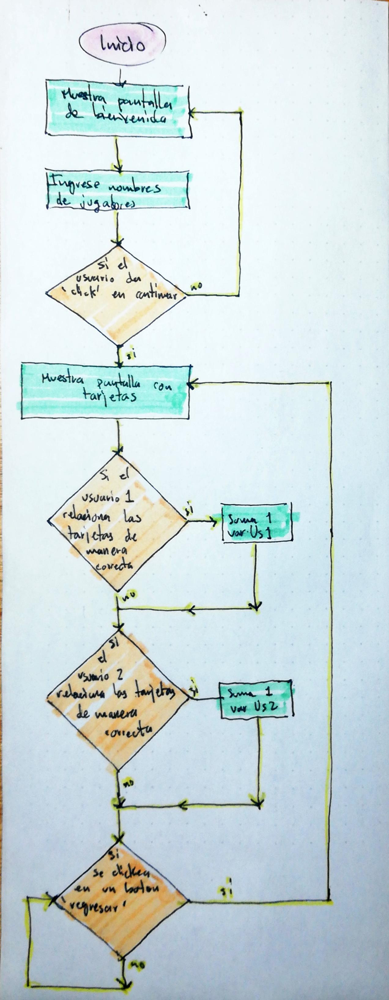
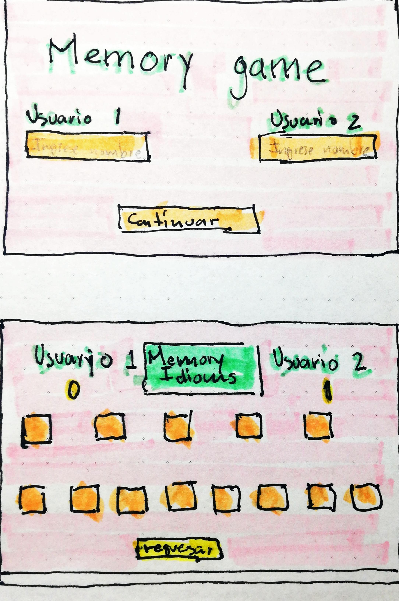

# 05memoryGame

Aplicación para jugar memorama en pareja

---

## 1.Definition

El usuario objetivo es aquel que quiere extender su vocabulario del idioma ingles jugando al mismo tiempo, este sitio esta diseñado para jugar por parejas para aprender, divertirte y competir al mismo tiempo.

Para ello se utilizaran 10 english idioms, "An idiom is a phrase, saying, or a group of words with a metaphorical (not literal) meaning, which has become accepted in common usage", que los usuarios tendran que relacionar, por ejemplo:

"Once in a blue moon" con "Meaning: very rarely"

Estos "english idioms" estaran acomodados en tarjetas. En una tarjeta estara el english idiom y en otra su significado, cuando algún usuario relacione de manera correcta las tarjetas se le sumara un punto a su puntuación.

Ganara el usuario que tenga mas puntos.

## User Stories

El usuario quiere poder jugar en parejas para pasar el tiempo

El usuario quiere poder jugar un juego de memoria (memorama) relacionado a sus intereses

El usuario quiere ver la puntuación del jugador perdedor y la del ganador con sus respectivos nombres

### Propuestas

Para cumplir los requerimientos del usuario se desarrollara una aplicación pensada para dispositivos mobiles ,ipad y de escritorio. Donde el usuario podra jugar en pareja para competir y determinar las parejas de los english idioms con sus significados, se mostrara en una primera pantalla recuadros de entrada de datos (inputs) para que los usuarios ingresen su nombre, posteriormente se mostrara el juego tipo memorama y los usuarios se turnaran para voltear las tarjetas.

Finalmente se mostrarara la puntuación final de cada jugador.

### Viabilidad

Si el tiempo de desarollo lo permite se implementara la caracteristica de musica de fondo, asi como efectos de sonido al relacionar una tarjeta de forma correcta e incorrecta.

---

## 2.Diseño

El proyecto contara con una pantalla de bienvenida, donde se mostrara el nombre del proyecto con recuadros de entrada de datos (inputs) para ingresar el nombre de los usuarios que jugaran.

Posteriormente en una segunda pantalla se mostrara las cartas boca abajo que el usuario tendra que 'clickear' para voltear y determinar si es pareja con una segunda carta.

Finalmente se mostrara la punuacion final de cada jugador y un boton de regresar por si se quiere volver a jugar.




### Pseudocodigo general

```

Mostrar pantalla de bienvenida
Ingresar los usuarios en un input
Si el usuario le da clik a un boton de continuar, se mostrara la segunda pantalla con los nombres de los jugadores
Sera el turno del jugador numero1
Si el jugador1 relaciona de manera correcta las cartas se sumara uno a su puntuacion y sera el turno del otro jugador(jugador2)
De la misma manera en el turno del otro jugador, si el jugador2 relaciona de manera correcta las cartas se sumara uno a su puntuación y sera el turno del otro jugador(jugador1)
Al finalizar las cartas se mostrara la puntuación final de cada jugador y un boton de regresar si se quiere volver a jugar.

```
